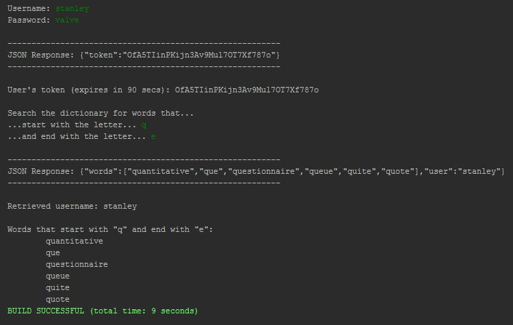
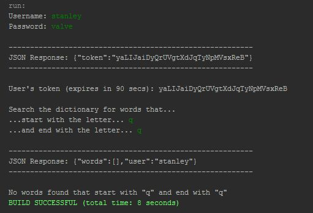
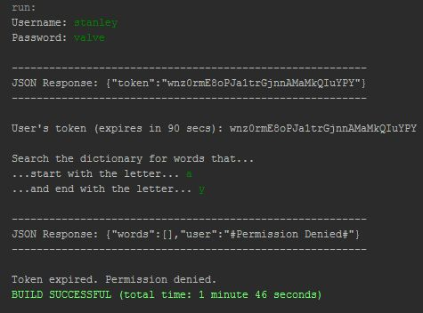
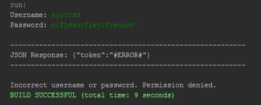

# RESTful-Dictionary-Client
An example of a REST web service client that sends a user's credentials to the server, receives an authentication token and looks up for words from a dictionary that start and/or end with two given letters.

All data are being sent and received with the **JSON** format.

### Execution example
##### _Successful login with valid token and words found_

##### _Successful login with valid token but words not found_

##### _Successful login but invalid token_

##### _Unsuccessful login_

Tied with sister project [RESTful-Dictionary-Server](https://github.com/Coursal/RESTful-Dictionary-Server).

Server written and tested in NetBeans 8.2 (requires JSON.simple jar file, added in the project directory).
